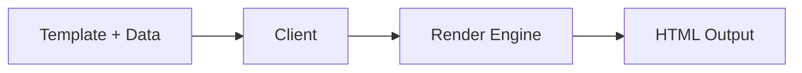

## Introduction

The OpenComponents Client is a server-side rendering utility that enables you to render OpenComponents templates on the server. It is part of the `oc` framework and is re-exported from the `oc-client` package.

## Installation

The Client is included when you install the `oc` package:

```bash
npm install oc
```

## Basic Usage

```typescript
import { Client } from 'oc';

// Initialize the client with template configuration
const client = Client({ 
  templates: [
    {
      type: 'oc-template-handlebars',
      version: '6.0.0',
      externals: []
    },
    {
      type: 'oc-template-jade',
      version: '7.0.0',
      externals: []
    }
  ]
});
```

## When to Use the Client

The Client is primarily used for:

<CardGroup cols={2}>
  <Card title="Server-Side Rendering" icon="server">
    Render component templates on the server before sending HTML to the browser
  </Card>
  <Card title="Registry Implementation" icon="database">
    Used internally by the OpenComponents registry to render components
  </Card>
  <Card title="Custom Rendering" icon="code">
    Build custom rendering pipelines for OpenComponents
  </Card>
  <Card title="Template Processing" icon="file-code">
    Process and render compiled component templates
  </Card>
</CardGroup>

## Key Features

### Template Support

The Client supports multiple template types:
- `oc-template-handlebars` - Handlebars templates
- `oc-template-jade` - Jade/Pug templates
- `oc-template-es6` - ES6/React templates
- Custom template types

### Template Registration

When initializing the Client, you must provide information about the templates your application will use. This allows the Client to properly render components built with different template engines.

```typescript
const client = Client({
  templates: [
    {
      type: 'oc-template-handlebars',
      version: '6.0.0',
      externals: []
    }
  ]
});
```

## Architecture

The Client acts as a rendering engine that:

1. **Receives** compiled template code and data
2. **Processes** the template with the provided data
3. **Returns** rendered HTML via callback



## Related Resources

<CardGroup cols={2}>
  <Card title="Client Methods" icon="function" href="/api/client/methods">
    Learn about available Client methods
  </Card>
  <Card title="Registry API" icon="server" href="/api-reference/introduction">
    Explore the Registry HTTP API
  </Card>
</CardGroup>

## TypeScript Support

The Client is fully typed when using TypeScript:

```typescript
import { Client } from 'oc';
import type { Template } from 'oc';

const client = Client({ templates: [] });
```

<Note>
  The Client is primarily used internally by the OpenComponents registry. Most users will interact with components through the registry's HTTP API rather than using the Client directly.
</Note>
