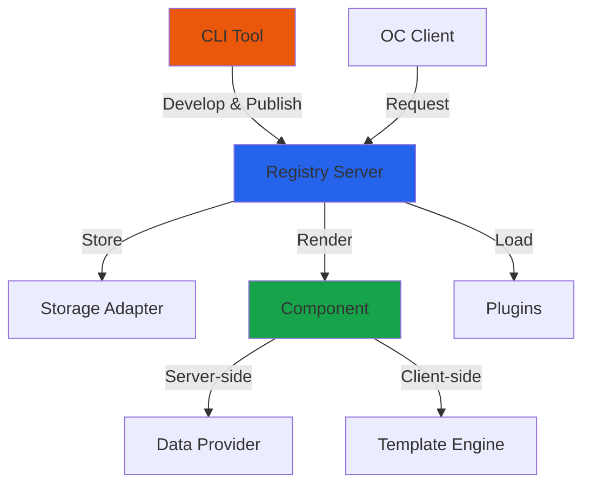
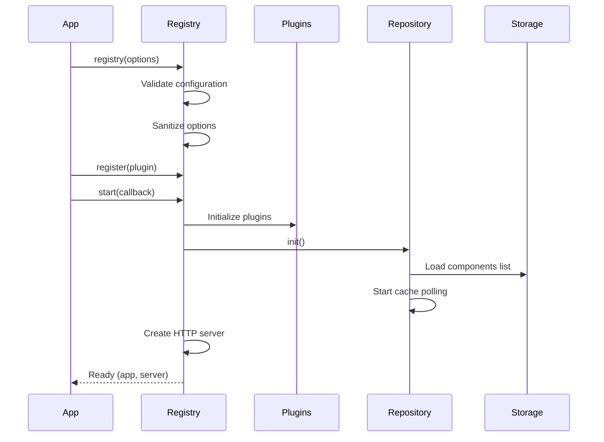
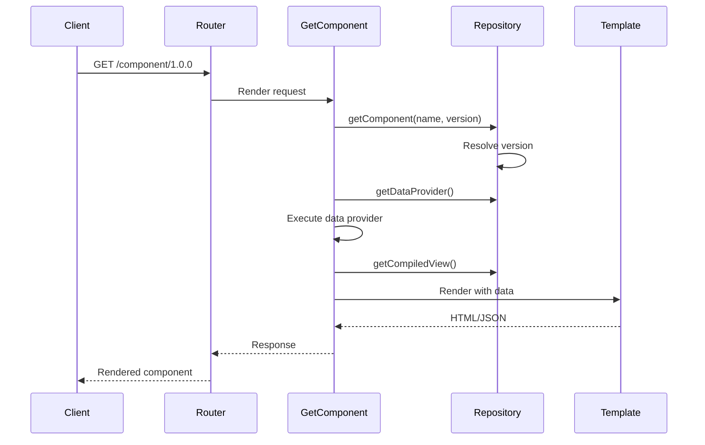

## Overview

OpenComponents is a framework for developing and distributing HTML components. It follows a distributed architecture where components are published to a registry and consumed by clients across different applications.

<Frame>

</Frame>

## Core Systems

OpenComponents consists of three primary systems that work together:

<CardGroup cols={3}>
  <Card title="Registry" icon="server" iconType="solid">
    Central HTTP server that stores, serves, and renders components
  </Card>
  <Card title="CLI" icon="terminal" iconType="solid">
    Development tools for creating, packaging, and publishing components
  </Card>
  <Card title="Client" icon="browser" iconType="solid">
    JavaScript library for requesting and rendering components in web applications
  </Card>
</CardGroup>

## Registry Architecture

The registry is built on Express.js and follows a domain-driven design pattern.

### Directory Structure

```
src/registry/
├── domain/              # Business logic layer
│   ├── repository.ts    # Component storage abstraction
│   ├── plugins-initialiser.ts
│   ├── register-templates.ts
│   ├── components-cache/
│   └── validators/      # Input validation
├── routes/              # HTTP endpoint handlers
├── middleware/          # Express middleware
└── views/               # UI components
```

### Key Components

<AccordionGroup>
  <Accordion title="Repository Layer" icon="database">
    The repository (`src/registry/domain/repository.ts`) provides a unified interface for component storage:
    
    ```typescript
    interface Repository {
      getComponent(name: string, version?: string): Promise<Component>;
      getComponentVersions(name: string): Promise<string[]>;
      publishComponent(details: PublishDetails): Promise<void>;
      getCompiledView(name: string, version: string): Promise<string>;
      getDataProvider(name: string, version: string): Promise<{content: string}>;
    }
    ```
    
    Supports both:
    - **Local mode**: Serves components from filesystem
    - **CDN mode**: Serves components from storage adapters (S3, Azure, etc.)
  </Accordion>

  <Accordion title="Router & Routes" icon="route">
    Express routes handle different operations:
    
    - `GET /:componentName/:componentVersion` - Render component
    - `PUT /:componentName/:componentVersion` - Publish component
    - `GET /:componentName/:componentVersion~info` - Component metadata
    - `GET /:componentName/:componentVersion~preview` - Preview UI
    - `POST /` - Batch component rendering
    
    Location: `src/registry/router.ts`
  </Accordion>

  <Accordion title="Components Cache" icon="bolt">
    The cache system (`src/registry/domain/components-cache/`) optimizes component discovery:
    
    - **Polling mechanism**: Regularly checks storage for updates
    - **JSON snapshot**: Maintains `components.json` with available components
    - **Refresh on publish**: Invalidates cache when new versions are published
    - **Configurable intervals**: `pollingInterval` setting controls refresh rate
  </Accordion>

  <Accordion title="Middleware Stack" icon="layer-group">
    Request processing pipeline:
    
    1. **CORS**: Cross-origin resource sharing
    2. **Compression**: Gzip/Brotli response compression
    3. **Base URL Handler**: Dynamic baseUrl computation
    4. **Discovery Handler**: Enable/disable discovery endpoints
    5. **File Uploads**: Handle component package uploads
    6. **Request Handler**: Core request processing
  </Accordion>
</AccordionGroup>

## Component Lifecycle

<Steps>
  <Step title="Development">
    Developer creates component using CLI:
    ```bash
    oc init my-component
    oc dev . 3030
    ```
  </Step>
  
  <Step title="Packaging">
    CLI compiles and packages component:
    - Compiles template (Handlebars, Jade, or React/ES6)
    - Bundles server-side code (data provider)
    - Packages static assets
    - Generates `package.json` with metadata
  </Step>
  
  <Step title="Publishing">
    Component is published to registry:
    ```bash
    oc publish my-component/
    ```
    Registry validates, stores, and indexes the component
  </Step>
  
  <Step title="Discovery">
    Registry maintains components list in cache and storage for fast lookup
  </Step>
  
  <Step title="Rendering">
    Client requests component, registry:
    1. Resolves version (if not specified)
    2. Executes data provider (server-side)
    3. Renders template with data
    4. Returns HTML or JSON response
  </Step>
</Steps>

## Configuration Architecture

The registry accepts comprehensive configuration options defined in `src/types.ts`:

<CodeGroup>
```typescript Essential Settings
interface Config {
  baseUrl: string;           // Public registry URL
  port: number;              // HTTP port
  prefix: string;            // URL prefix (e.g., '/components/')
  local: boolean;            // Local vs CDN mode
  storage: StorageConfig;    // Storage adapter configuration
  templates: Template[];     // Template engines
  plugins: Plugins;          // Registered plugins
}
```

```typescript Storage & Discovery
interface Config {
  s3?: {                     // S3 storage (convenience config)
    bucket: string;
    region: string;
    componentsDir: string;
  };
  
  discovery: {
    robots: boolean;         // SEO indexing
    api: boolean;            // Enable API endpoints
    ui: boolean;             // Enable discovery UI
    validate: boolean;       // Enable validation endpoint
  };
  
  pollingInterval: number;   // Cache refresh (seconds)
  refreshInterval?: number;  // Component list refresh
}
```

```typescript Advanced Features
interface Config {
  publishAuth?: PublishAuthConfig;  // Authentication
  publishValidation: (pkg, context) => boolean;
  
  dependencies: string[];    // Allowed npm packages
  env: Record<string, string>;  // Environment variables
  
  executionTimeout?: number; // Component timeout (seconds)
  hotReloading: boolean;     // Development mode
  
  routes?: Array<{           // Custom routes
    route: string;
    method: string;
    handler: RequestHandler;
  }>;
}
```
</CodeGroup>

## Storage Abstraction

OpenComponents uses storage adapters to support multiple backends:

```typescript
interface StorageAdapter {
  getFile(filePath: string): Promise<string>;
  getJson<T>(filePath: string): Promise<T>;
  putDir(dirPath: string, destPath: string): Promise<void>;
  adapterType: string;
}
```

<Tip>
Built-in adapters available:
- **S3**: Amazon S3 / Compatible services
- **Azure**: Azure Blob Storage
- **Local**: Filesystem storage

Create custom adapters by implementing the `StorageAdapter` interface.
</Tip>

## Execution Flow

### Registry Startup



### Component Request



## Programmatic API

Both registry and CLI can be used programmatically:

<CodeGroup>
```typescript Registry API
import { Registry } from 'opencomponents';

const registry = Registry({
  baseUrl: 'https://my-registry.com/',
  port: 3000,
  storage: {
    adapter: s3Adapter,
    options: {
      bucket: 'my-components',
      region: 'us-east-1',
      componentsDir: 'components'
    }
  }
});

// Register plugins
registry.register(myPlugin);

// Start server
registry.start((err, { app, server }) => {
  if (err) throw err;
  console.log('Registry started');
});
```

```typescript CLI API
import { cli } from 'opencomponents';

// Publish component
cli.publish({
  componentPath: './my-component',
  logger: console
}, (err, result) => {
  if (err) throw err;
  console.log('Published:', result);
});

// Start dev server
cli.dev({
  dirName: '.',
  port: 3030,
  logger: console
}, (err, result) => {
  if (err) throw err;
});
```
</CodeGroup>

## Domain-Driven Design

The codebase follows domain-driven design principles:

<CardGroup cols={2}>
  <Card title="Domain Layer" icon="cube">
    **Pure business logic**
    
    - Component validation
    - Version resolution
    - Template registration
    - Cache management
    
    Location: `src/*/domain/`
  </Card>
  
  <Card title="Facade Layer" icon="window">
    **User-facing APIs**
    
    - CLI commands
    - Public interfaces
    - Orchestration
    
    Location: `src/cli/facade/`
  </Card>
  
  <Card title="Routes Layer" icon="route">
    **HTTP endpoints**
    
    - Request handling
    - Response formatting
    - Error handling
    
    Location: `src/registry/routes/`
  </Card>
  
  <Card title="Utilities" icon="wrench">
    **Shared helpers**
    
    - Type validators
    - Module loaders
    - NPM utilities
    
    Location: `src/utils/`
  </Card>
</CardGroup>

## Type System

All shared types are centralized in `src/types.ts`:

```typescript
// Component metadata
interface Component extends PackageJson {
  allVersions: string[];
  name: string;
  oc: OcConfiguration;
  version: string;
}

// Template engine interface
interface Template {
  compile?: (options: CompilerOptions, cb: Callback) => void;
  getCompiledTemplate: (templateString: string, key: string) => CompiledTemplate;
  getInfo: () => TemplateInfo;
  render: (options: any, cb: Callback) => void;
}

// Plugin interface
interface Plugin<T = any> {
  name: string;
  description?: string;
  options?: T;
  register: {
    register: (options: T, dependencies: any, next: Callback) => void;
    execute: (...args: any[]) => any;
    dependencies?: string[];
  };
}
```

## Next Steps

<CardGroup cols={2}>
  <Card title="Components" href="/concepts/components" icon="cube">
    Learn about component structure and lifecycle
  </Card>
  <Card title="Registry" href="/concepts/registry" icon="server">
    Deep dive into registry concepts
  </Card>
  <Card title="Templates" href="/concepts/templates" icon="code">
    Understand template engines
  </Card>
  <Card title="Plugins" href="/concepts/plugins" icon="puzzle-piece">
    Extend functionality with plugins
  </Card>
</CardGroup>