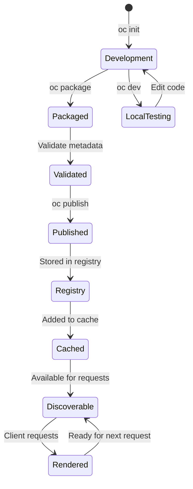

## What is a Component?

An OpenComponent is a self-contained, reusable HTML fragment with:

<CardGroup cols={2}>
  <Card title="Template" icon="code">
    View layer (Handlebars, Jade, or React/ES6)
  </Card>
  <Card title="Data Provider" icon="database">
    Server-side logic to fetch data
  </Card>
  <Card title="Static Assets" icon="image">
    CSS, images, client-side JavaScript
  </Card>
  <Card title="Configuration" icon="gear">
    Metadata, parameters, and settings
  </Card>
</CardGroup>

## Component Structure

### Development Structure

During development, a component has this structure:

```
my-component/
├── package.json         # Component metadata
├── template.hbs         # View template (or .jsx, .jade)
├── server.js            # Data provider (optional)
├── static/              # Static assets (optional)
│   ├── style.css
│   ├── script.js
│   └── images/
└── .env                 # Environment variables (optional)
```

### Packaged Structure

After compilation (`oc package`), components are packaged:

```
my-component/
└── _package/
    ├── package.json     # Updated with oc metadata
    ├── template.js      # Compiled template
    ├── server.js        # Bundled data provider
    ├── style.css        # Static assets
    └── *.map            # Source maps
```

## Component Metadata

The `package.json` contains standard npm fields plus OpenComponents configuration:

<CodeGroup>
```json Basic Metadata
{
  "name": "my-component",
  "version": "1.0.0",
  "description": "My reusable component",
  "author": {
    "name": "John Doe",
    "email": "john@example.com"
  },
  "oc": {
    // OpenComponents configuration
  }
}
```

```json OC Configuration
{
  "oc": {
    "files": {
      "template": {
        "src": "template.hbs",
        "type": "handlebars",
        "hashKey": "abc123..."
      },
      "dataProvider": {
        "src": "server.js",
        "hashKey": "def456..."
      },
      "static": ["style.css", "script.js"]
    },
    "parameters": {
      "title": {
        "type": "string",
        "mandatory": true,
        "description": "Component title"
      }
    }
  }
}
```

```json Advanced Settings
{
  "oc": {
    "state": "experimental",  // or "deprecated"
    "container": true,         // Wrap in container div
    "renderInfo": true,        // Include render metadata
    "plugins": ["my-plugin"],  // Required plugins
    "date": 1234567890,        // Publish timestamp
    "publisher": "john"        // Publisher username
  }
}
```
</CodeGroup>

## Component Parameters

Components can accept parameters with type validation and constraints:

```typescript
interface OcParameter {
  type: 'string' | 'boolean' | 'number';
  mandatory?: boolean;
  default?: string | boolean | number;
  description?: string;
  example?: string | boolean | number;
  enum?: string[] | number[] | boolean[];  // Restrict to specific values
}
```

### Parameter Examples

<CodeGroup>
```json Required String
{
  "parameters": {
    "userId": {
      "type": "string",
      "mandatory": true,
      "description": "User ID to display",
      "example": "user-123"
    }
  }
}
```

```json Optional with Default
{
  "parameters": {
    "showAvatar": {
      "type": "boolean",
      "mandatory": false,
      "default": true,
      "description": "Whether to show user avatar"
    }
  }
}
```

```json Enum Constraint
{
  "parameters": {
    "theme": {
      "type": "string",
      "mandatory": false,
      "default": "light",
      "enum": ["light", "dark", "auto"],
      "description": "Color theme"
    }
  }
}
```

```json Numeric Range
{
  "parameters": {
    "limit": {
      "type": "number",
      "mandatory": false,
      "default": 10,
      "enum": [5, 10, 20, 50],
      "description": "Number of items to display"
    }
  }
}
```
</CodeGroup>

## Data Provider

The data provider is server-side JavaScript executed before rendering:

```javascript
// server.js
module.exports.data = async (context, callback) => {
  try {
    // Access parameters
    const { userId } = context.params;
    
    // Access environment variables
    const apiKey = context.env.API_KEY;
    
    // Use allowed dependencies
    const axios = require('axios');
    
    // Fetch data
    const response = await axios.get(`https://api.example.com/users/${userId}`, {
      headers: { 'Authorization': `Bearer ${apiKey}` }
    });
    
    // Use plugins (if registered)
    const formattedDate = context.plugins.formatDate(response.data.createdAt);
    
    // Return data to template
    callback(null, {
      user: response.data,
      formattedDate
    });
  } catch (error) {
    callback(error);
  }
};
```

### Context Object

The data provider receives a context object:

```typescript
interface Context {
  params: Record<string, any>;        // Component parameters
  env: Record<string, string>;        // Environment variables
  plugins: Record<string, Function>;  // Registered plugins
  requestHeaders: Record<string, string>;  // HTTP headers
  acceptLanguage?: string[];          // Accepted languages
  baseUrl: string;                    // Registry base URL
  renderComponent: (name, opts) => Promise<string>;  // Nested rendering
}
```

<Tip>
**Execution timeout**: Data providers are subject to `executionTimeout` configured on the registry. Keep operations fast and implement proper error handling.
</Tip>

## Template Types

OpenComponents supports three template types:

<Tabs>
  <Tab title="Handlebars">
    ```handlebars
    {{! template.hbs }}
    <div class="user-card">
      <h2>{{user.name}}</h2>
      <p>{{user.email}}</p>
      {{#if user.avatar}}
        
      {{/if}}
    </div>
    ```
    
    - **Type**: `oc-template-handlebars`
    - **Extension**: `.hbs`
    - **Use case**: Simple, logic-less templates
  </Tab>
  
  <Tab title="Jade/Pug">
    ```jade
    //- template.jade
    .user-card
      h2= user.name
      p= user.email
      if user.avatar
        img(src=user.avatar alt="Avatar")
    ```
    
    - **Type**: `oc-template-jade`
    - **Extension**: `.jade`
    - **Use case**: Concise, indentation-based syntax
  </Tab>
  
  <Tab title="React/ES6">
    ```jsx
    // template.jsx
    export default function UserCard({ user }) {
      return (
        <div className="user-card">
          <h2>{user.name}</h2>
          <p>{user.email}</p>
          {user.avatar && (
            
          )}
        </div>
      );
    }
    ```
    
    - **Type**: `oc-template-es6` or `oc-template-react`
    - **Extension**: `.jsx`
    - **Use case**: Modern React components with hooks
  </Tab>
</Tabs>

## Component Lifecycle



## Component States

Components can have lifecycle states:

<CardGroup cols={2}>
  <Card title="Experimental" icon="flask" color="#f59e0b">
    ```json
    {"oc": {"state": "experimental"}}
    ```
    Indicates component is under active development
  </Card>
  
  <Card title="Deprecated" icon="triangle-exclamation" color="#ef4444">
    ```json
    {"oc": {"state": "deprecated"}}
    ```
    Marks component for future removal
  </Card>
</CardGroup>

<Note>
The registry discovery UI groups components by state and can be configured to hide experimental components via the `discovery.experimental` setting.
</Note>

## Static Assets

Static files are served from the component's published location:

### Referencing in Templates

<CodeGroup>
```handlebars Handlebars
<link rel="stylesheet" href="{{staticPath}}style.css" />
<script src="{{staticPath}}script.js"></script>

```

```jsx React/ES6
export default function MyComponent(props) {
  return (
    <div>
      <link rel="stylesheet" href={props.staticPath + 'style.css'} />
      
    </div>
  );
}
```
</CodeGroup>

### Automatic Injection

The `staticPath` variable is automatically injected and points to:
- **Local mode**: `http://localhost:3000/my-component/1.0.0/static/`
- **CDN mode**: `https://cdn.example.com/components/my-component/1.0.0/`

## Component Versioning

OpenComponents follows semantic versioning:

<Steps>
  <Step title="Version Resolution">
    When no version specified, registry resolves to latest:
    ```
    /my-component        → my-component@1.2.5
    /my-component/1      → my-component@1.2.5
    /my-component/1.2    → my-component@1.2.5
    /my-component/1.2.5  → my-component@1.2.5
    ```
  </Step>
  
  <Step title="Version Storage">
    Each version is stored independently:
    ```
    components/
    └── my-component/
        ├── 1.0.0/
        ├── 1.1.0/
        └── 1.2.5/
    ```
  </Step>
  
  <Step title="Immutability">
    Published versions cannot be overwritten. Publishing the same version fails:
    ```
    Error: Version 1.2.5 already exists for my-component
    ```
  </Step>
</Steps>

## Component Interface

Internal TypeScript representation:

```typescript
interface Component extends PackageJson {
  allVersions: string[];  // All published versions
  name: string;
  version: string;
  oc: OcConfiguration;    // OpenComponents metadata
}

interface OcConfiguration {
  container?: boolean;
  date: number;           // Publish timestamp
  files: {
    template: {
      src: string;
      type: string;       // Template type
      hashKey: string;    // Content hash
      version: string;    // Template version
      size?: number;
    };
    dataProvider: {
      src: string;
      hashKey: string;
      type: string;
      size?: number;
    };
    static: string[];
    imports?: Record<string, string>;  // Import maps
    env?: string;         // .env file path
  };
  parameters: Record<string, OcParameter>;
  plugins?: string[];     // Required plugins
  packaged: boolean;      // Is packaged?
  renderInfo?: boolean;
  state?: 'deprecated' | 'experimental';
  stringifiedDate: string;
  publisher?: string;
}
```

## Nested Components

Components can render other components server-side:

```javascript
// server.js
module.exports.data = async (context, callback) => {
  const { renderComponent } = context;
  
  try {
    // Render another component
    const headerHtml = await renderComponent('header-component', {
      parameters: { title: 'My Page' }
    });
    
    callback(null, {
      header: headerHtml
    });
  } catch (error) {
    callback(error);
  }
};
```

```handlebars
{{! template.hbs }}
<div class="page">
  {{{header}}}
  <main>
    <!-- Page content -->
  </main>
</div>
```

<Warning>
**Performance consideration**: Nested rendering adds latency. Use judiciously and consider caching strategies.
</Warning>

## Environment Variables

Components can use environment variables for configuration:

### Setup

```bash
# my-component/.env
API_KEY=secret-key-123
API_ENDPOINT=https://api.example.com
```

```json
// package.json
{
  "oc": {
    "files": {
      "env": ".env"
    }
  }
}
```

### Access in Data Provider

```javascript
module.exports.data = (context, callback) => {
  const apiKey = context.env.API_KEY;
  const endpoint = context.env.API_ENDPOINT;
  
  // Use environment variables
};
```

<Note>
**Registry-level env**: The registry can inject additional environment variables via the `env` configuration option, available to all components.
</Note>

## Dependencies

Components can require npm packages configured on the registry:

```javascript
// server.js
module.exports.data = async (context, callback) => {
  // These must be in registry's dependencies list
  const lodash = require('lodash');
  const moment = require('moment');
  
  const data = lodash.groupBy(items, 'category');
  const formatted = moment().format('YYYY-MM-DD');
  
  callback(null, { data, formatted });
};
```

### Registry Configuration

```typescript
const registry = Registry({
  // ... other config
  dependencies: ['lodash', 'moment', 'axios']
});
```

<Warning>
**Security**: Only whitelisted dependencies can be required. This prevents arbitrary code execution.
</Warning>

## Next Steps

<CardGroup cols={2}>
  <Card title="Create Your First Component" href="/components/creating-components" icon="plus">
    Step-by-step guide to building a component
  </Card>
  <Card title="Templates" href="/concepts/templates" icon="code">
    Learn about template engines
  </Card>
  <Card title="Publishing" href="/cli/publish" icon="upload">
    Publish components to registry
  </Card>
  <Card title="Registry Concepts" href="/concepts/registry" icon="server">
    Understand registry internals
  </Card>
</CardGroup>