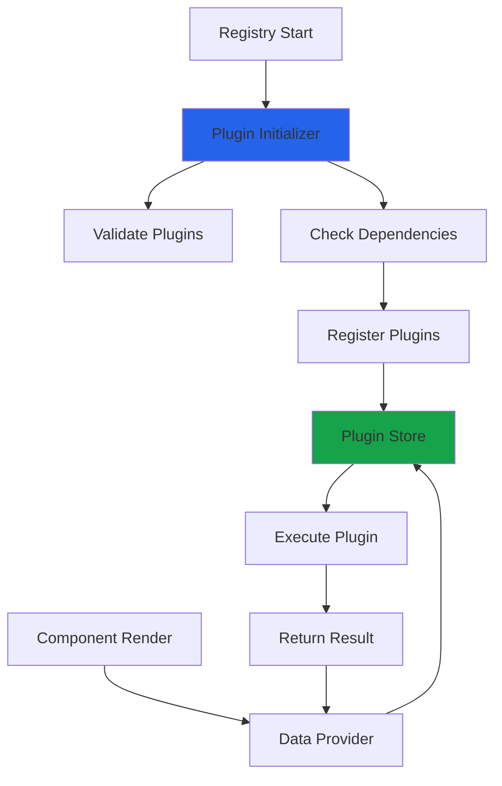
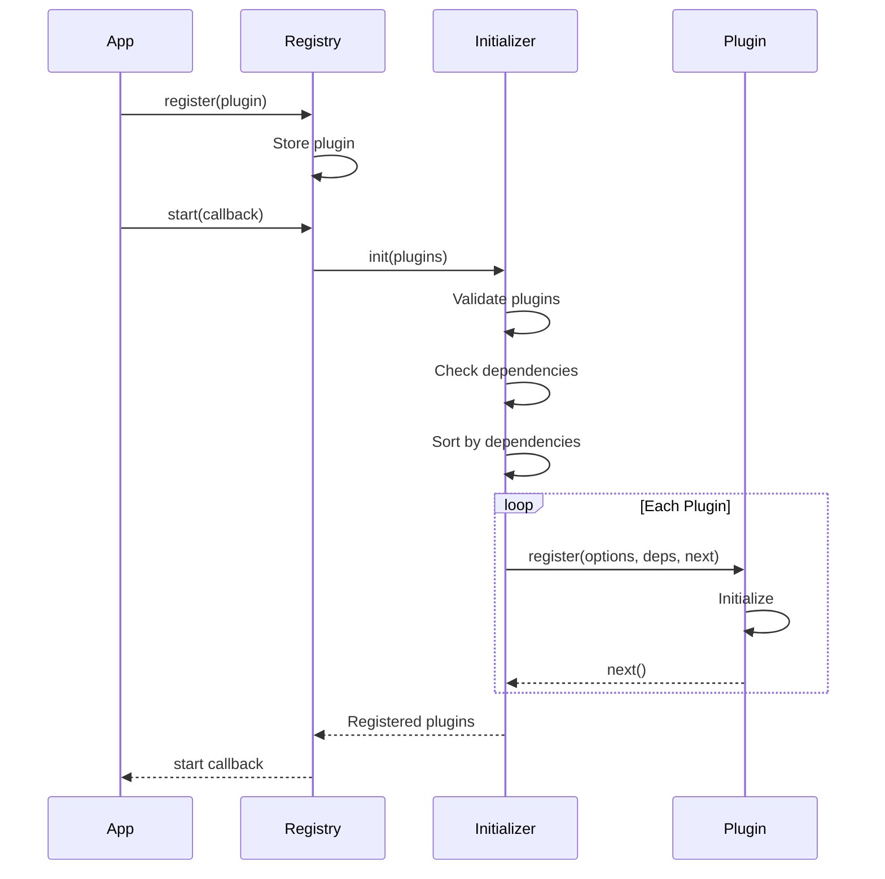

## What are Plugins?

Plugins extend the OpenComponents registry with custom functionality that components can use in their data providers. They provide:

<CardGroup cols={2}>
  <Card title="Shared Logic" icon="share-nodes">
    Reusable functions across all components
  </Card>
  <Card title="External Services" icon="globe">
    Integration with APIs and databases
  </Card>
  <Card title="Utility Functions" icon="wrench">
    Date formatting, validation, transformations
  </Card>
  <Card title="Custom Dependencies" icon="code">
    Business-specific functionality
  </Card>
</CardGroup>

## Plugin Architecture



## Plugin Interface

Plugins implement a standard interface:

```typescript
interface Plugin<T = any> {
  name: string;                  // Unique plugin name
  description?: string;          // Human-readable description
  options?: T;                   // Plugin configuration
  context?: boolean;             // Context-aware execution
  
  register: {
    // Initialization function
    register: (
      options: T,
      dependencies: any,
      next: (error?: Error) => void
    ) => void;
    
    // Plugin function
    execute: (...args: any[]) => any;
    
    // Other plugins this plugin depends on
    dependencies?: string[];
  };
}
```

**Location:** `src/types.ts:434-504`

## Basic Plugin Example

### Plugin Implementation

```typescript
const formatDatePlugin = {
  name: 'formatDate',
  description: 'Format dates in various formats',
  
  register: {
    register: (options, dependencies, next) => {
      // Initialization logic
      console.log('formatDate plugin registered');
      next();
    },
    
    execute: (date, format = 'YYYY-MM-DD') => {
      // Plugin logic
      const d = new Date(date);
      
      switch (format) {
        case 'YYYY-MM-DD':
          return d.toISOString().split('T')[0];
        case 'MM/DD/YYYY':
          return `${d.getMonth() + 1}/${d.getDate()}/${d.getFullYear()}`;
        case 'long':
          return d.toLocaleDateString('en-US', { 
            year: 'numeric', 
            month: 'long', 
            day: 'numeric' 
          });
        default:
          return d.toISOString();
      }
    }
  }
};

export default formatDatePlugin;
```

### Registration

```typescript
import { Registry } from 'opencomponents';
import formatDatePlugin from './plugins/format-date';

const registry = Registry({
  baseUrl: 'http://localhost:3000/',
  port: 3000,
  // ... other config
});

// Register plugin
registry.register(formatDatePlugin);

registry.start((err) => {
  if (err) throw err;
  console.log('Registry started with formatDate plugin');
});
```

### Usage in Components

```javascript
// component/server.js
module.exports.data = (context, callback) => {
  const { formatDate } = context.plugins;
  
  const publishDate = formatDate('2024-01-15', 'long');
  // Result: "January 15, 2024"
  
  const shortDate = formatDate('2024-01-15', 'MM/DD/YYYY');
  // Result: "01/15/2024"
  
  callback(null, {
    publishDate,
    shortDate
  });
};
```

## Plugin Context

Plugins can be context-aware to access component metadata:

### Context-Aware Plugin

```typescript
const loggingPlugin = {
  name: 'logger',
  context: true,  // Enable context
  
  register: {
    register: (options, dependencies, next) => {
      console.log('Logger plugin registered');
      next();
    },
    
    // With context: true, execute receives context first
    execute: (context) => {
      const { name, version } = context;
      
      // Return the actual plugin function
      return (message, level = 'info') => {
        const timestamp = new Date().toISOString();
        console.log(`[${timestamp}] [${level}] ${name}@${version}: ${message}`);
      };
    }
  }
};
```

### Context Object

```typescript
interface PluginContext {
  name: string;     // Component name
  version: string;  // Component version
}
```

### Usage

```javascript
// component/server.js
module.exports.data = (context, callback) => {
  const { logger } = context.plugins;
  
  logger('Fetching user data', 'info');
  // Logs: [2024-01-15T10:30:00Z] [info] user-card@1.0.0: Fetching user data
  
  try {
    const data = fetchData();
    callback(null, data);
  } catch (error) {
    logger(`Error: ${error.message}`, 'error');
    callback(error);
  }
};
```

## Plugin Dependencies

Plugins can depend on other plugins:

### Dependency Chain

```typescript
// Base plugin
const configPlugin = {
  name: 'config',
  
  register: {
    register: (options, dependencies, next) => {
      next();
    },
    execute: () => ({
      apiUrl: 'https://api.example.com',
      timeout: 5000
    })
  }
};

// Dependent plugin
const apiClientPlugin = {
  name: 'apiClient',
  
  register: {
    dependencies: ['config'],  // Depends on config plugin
    
    register: (options, dependencies, next) => {
      // Access other plugins
      const { config } = dependencies;
      const { apiUrl } = config.handler();
      
      console.log('API client initialized with:', apiUrl);
      next();
    },
    
    execute: (dependencies) => {
      const { config } = dependencies;
      
      return async (endpoint) => {
        const { apiUrl, timeout } = config.handler();
        // Make API request
        return fetch(`${apiUrl}${endpoint}`, { timeout });
      };
    }
  }
};
```

### Registration Order

The plugin initializer handles dependency resolution:

```typescript
registry.register(apiClientPlugin);  // Depends on config
registry.register(configPlugin);     // Base plugin

// Initializer automatically orders: config → apiClient
```

**Location:** `src/registry/domain/plugins-initialiser.ts`

## Plugin Initialization

Plugins are initialized during registry startup:

### Initialization Flow



### Async Initialization

```typescript
const databasePlugin = {
  name: 'database',
  options: {
    connectionString: process.env.DB_CONNECTION
  },
  
  register: {
    register: async (options, dependencies, next) => {
      try {
        // Async setup
        const db = await connectToDatabase(options.connectionString);
        await db.ping();
        
        console.log('Database connected');
        next();  // Signal success
      } catch (error) {
        next(error);  // Signal failure
      }
    },
    
    execute: () => {
      return {
        query: async (sql) => {
          // Database operations
        }
      };
    }
  }
};
```

## Advanced Plugin Patterns

### Configuration-Based Plugin

```typescript
interface CacheConfig {
  ttl: number;      // Time to live in seconds
  maxSize: number;  // Max cache size
}

const cachePlugin = {
  name: 'cache',
  description: 'Simple in-memory cache',
  options: {
    ttl: 300,
    maxSize: 1000
  } as CacheConfig,
  
  register: {
    register: (options: CacheConfig, dependencies, next) => {
      const cache = new Map();
      const timestamps = new Map();
      
      // Cleanup old entries periodically
      setInterval(() => {
        const now = Date.now();
        for (const [key, timestamp] of timestamps) {
          if (now - timestamp > options.ttl * 1000) {
            cache.delete(key);
            timestamps.delete(key);
          }
        }
      }, 60000);  // Check every minute
      
      next();
    },
    
    execute: (options: CacheConfig) => {
      const cache = new Map();
      const timestamps = new Map();
      
      return {
        get: (key: string) => {
          const timestamp = timestamps.get(key);
          if (!timestamp) return null;
          
          const age = Date.now() - timestamp;
          if (age > options.ttl * 1000) {
            cache.delete(key);
            timestamps.delete(key);
            return null;
          }
          
          return cache.get(key);
        },
        
        set: (key: string, value: any) => {
          // Enforce max size
          if (cache.size >= options.maxSize) {
            const firstKey = cache.keys().next().value;
            cache.delete(firstKey);
            timestamps.delete(firstKey);
          }
          
          cache.set(key, value);
          timestamps.set(key, Date.now());
        },
        
        clear: () => {
          cache.clear();
          timestamps.clear();
        }
      };
    }
  }
};
```

### Middleware-Style Plugin

```typescript
const requestTrackerPlugin = {
  name: 'requestTracker',
  
  register: {
    register: (options, dependencies, next) => {
      const requests = new Map();
      
      // Expose internal state for monitoring
      this.getStats = () => ({
        totalRequests: requests.size,
        components: Array.from(requests.entries())
      });
      
      next();
    },
    
    execute: (context) => {
      const { name, version } = context;
      const key = `${name}@${version}`;
      
      return {
        start: () => {
          const startTime = Date.now();
          return {
            end: () => {
              const duration = Date.now() - startTime;
              console.log(`${key} rendered in ${duration}ms`);
            }
          };
        }
      };
    }
  }
};
```

## Plugin Best Practices

<AccordionGroup>
  <Accordion title="Error Handling" icon="triangle-exclamation">
    Always handle errors gracefully:
    
    ```typescript
    const safePlugin = {
      name: 'safePlugin',
      
      register: {
        register: (options, dependencies, next) => {
          try {
            // Initialization that might fail
            const resource = initializeResource();
            next();
          } catch (error) {
            console.error('Plugin initialization failed:', error);
            next(error);  // Pass error to registry
          }
        },
        
        execute: () => {
          return (input) => {
            try {
              // Plugin logic
              return processInput(input);
            } catch (error) {
              console.error('Plugin execution error:', error);
              return null;  // Return safe default
            }
          };
        }
      }
    };
    ```
  </Accordion>
  
  <Accordion title="Performance" icon="gauge-high">
    - **Lazy initialization**: Only initialize resources when first needed
    - **Caching**: Cache expensive computations
    - **Async operations**: Use async/await for I/O operations
    - **Resource cleanup**: Clean up resources on registry shutdown
    
    ```typescript
    const performantPlugin = {
      name: 'performant',
      
      register: {
        register: (options, dependencies, next) => {
          let lazyResource = null;
          
          this.getResource = () => {
            if (!lazyResource) {
              lazyResource = expensiveInit();
            }
            return lazyResource;
          };
          
          next();
        },
        
        execute: () => {
          const cache = new Map();
          
          return async (key) => {
            if (cache.has(key)) {
              return cache.get(key);
            }
            
            const result = await fetchData(key);
            cache.set(key, result);
            return result;
          };
        }
      }
    };
    ```
  </Accordion>
  
  <Accordion title="Type Safety" icon="shield">
    Use TypeScript for type-safe plugins:
    
    ```typescript
    import type { Plugin } from 'opencomponents';
    
    interface ValidationOptions {
      strict: boolean;
      maxLength: number;
    }
    
    const validationPlugin: Plugin<ValidationOptions> = {
      name: 'validate',
      options: {
        strict: true,
        maxLength: 100
      },
      
      register: {
        register: (options, dependencies, next) => {
          // options is typed as ValidationOptions
          console.log('Strict mode:', options.strict);
          next();
        },
        
        execute: (options: ValidationOptions) => {
          return (input: string): boolean => {
            if (options.strict && !input) {
              return false;
            }
            return input.length <= options.maxLength;
          };
        }
      }
    };
    ```
  </Accordion>
  
  <Accordion title="Testing" icon="flask">
    Test plugins in isolation:
    
    ```typescript
    // plugin.test.ts
    import myPlugin from './my-plugin';
    
    describe('myPlugin', () => {
      it('registers successfully', (done) => {
        myPlugin.register.register({}, {}, (error) => {
          expect(error).toBeUndefined();
          done();
        });
      });
      
      it('executes correctly', () => {
        const handler = myPlugin.register.execute({});
        const result = handler('test input');
        expect(result).toBe('expected output');
      });
    });
    ```
  </Accordion>
</AccordionGroup>

## Plugin Discovery

Plugins are exposed via the discovery API:

```bash
GET /~registry/plugins
```

```json
{
  "plugins": {
    "formatDate": {
      "description": "Format dates in various formats",
      "context": false
    },
    "logger": {
      "description": "Component logging utility",
      "context": true
    },
    "cache": {
      "description": "Simple in-memory cache",
      "context": false
    }
  }
}
```

## Component Plugin Requirements

Components can declare required plugins:

```json
{
  "name": "my-component",
  "version": "1.0.0",
  "oc": {
    "plugins": ["formatDate", "cache"]
  }
}
```

The registry validates plugin availability during publishing:

```typescript
// Validation (src/registry/domain/validators/plugins-requirements.ts)
if (!allPluginsAvailable(component.oc.plugins, registry.plugins)) {
  throw new Error('Required plugins not available');
}
```

## Real-World Plugin Examples

<CodeGroup>
```typescript HTTP Client
const httpClientPlugin = {
  name: 'http',
  
  register: {
    register: (options, dependencies, next) => {
      const axios = require('axios');
      this.client = axios.create({
        timeout: 5000,
        headers: { 'User-Agent': 'OC-Registry' }
      });
      next();
    },
    
    execute: () => {
      return {
        get: (url, config) => this.client.get(url, config),
        post: (url, data, config) => this.client.post(url, data, config)
      };
    }
  }
};
```

```typescript Feature Flags
const featureFlagsPlugin = {
  name: 'featureFlags',
  options: {
    apiKey: process.env.FEATURE_FLAGS_API_KEY
  },
  
  register: {
    register: async (options, dependencies, next) => {
      try {
        this.flags = await fetchFlags(options.apiKey);
        next();
      } catch (error) {
        next(error);
      }
    },
    
    execute: () => {
      return {
        isEnabled: (flag) => {
          return this.flags[flag] === true;
        }
      };
    }
  }
};
```

```typescript Localization
const i18nPlugin = {
  name: 'i18n',
  
  register: {
    register: (options, dependencies, next) => {
      const translations = loadTranslations();
      this.translations = translations;
      next();
    },
    
    execute: (context) => {
      return (key, locale = 'en') => {
        return this.translations[locale]?.[key] || key;
      };
    }
  }
};
```
</CodeGroup>

## Next Steps

<CardGroup cols={2}>
  <Card title="Component Concepts" href="/concepts/components" icon="cube">
    Use plugins in components
  </Card>
  <Card title="Registry Concepts" href="/concepts/registry" icon="server">
    Understand registry internals
  </Card>
  <Card title="Creating Plugins" href="/advanced/plugins" icon="plus">
    Build your first plugin
  </Card>
  <Card title="API Reference" href="/api/types/plugin" icon="book">
    Plugin API documentation
  </Card>
</CardGroup>