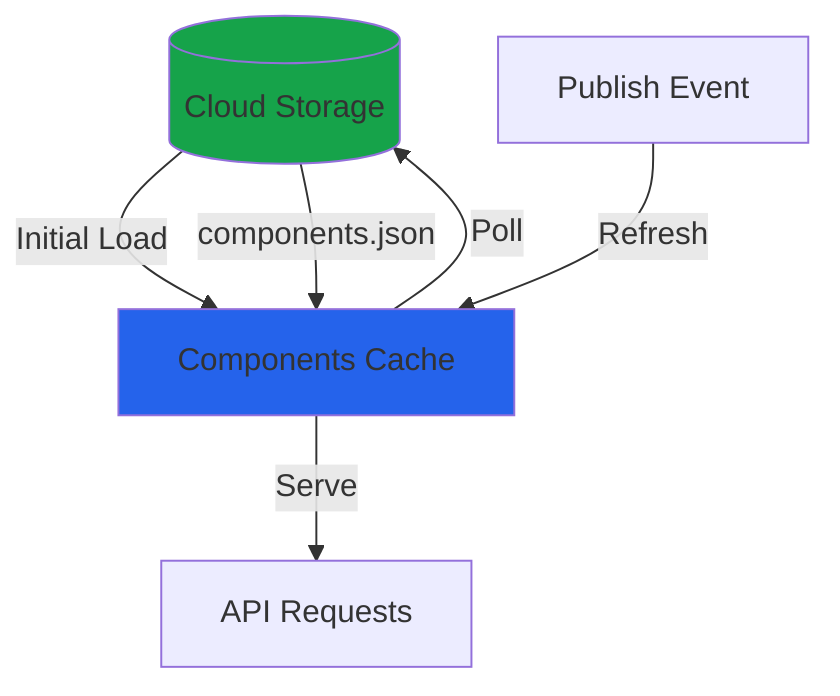
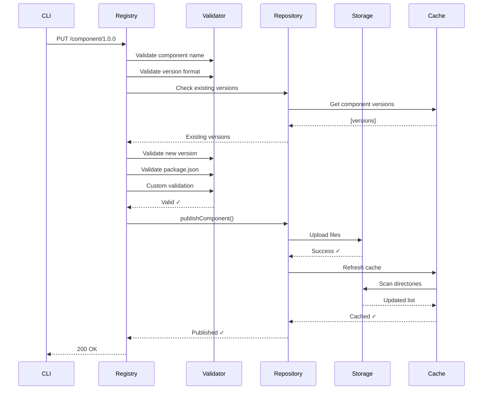
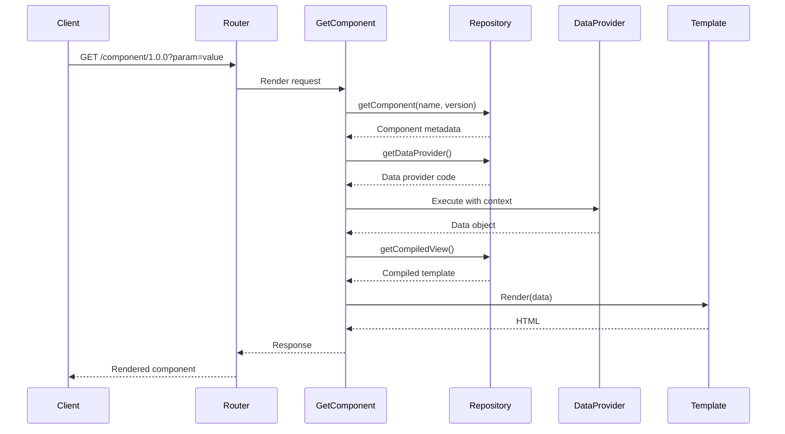

## What is the Registry?

The OpenComponents registry is an HTTP server that:

<CardGroup cols={2}>
  <Card title="Stores" icon="database">
    Component versions in cloud storage or filesystem
  </Card>
  <Card title="Serves" icon="globe">
    Components to clients via HTTP API
  </Card>
  <Card title="Renders" icon="paintbrush">
    Components server-side with data
  </Card>
  <Card title="Manages" icon="list">
    Component discovery and versioning
  </Card>
</CardGroup>

## Registry Modes

The registry operates in two distinct modes:

<Tabs>
  <Tab title="Production (CDN Mode)">
    <Frame>
    ```mermaid
    graph LR
        CLI[CLI Publish] -->|Upload| Storage[Cloud Storage]
        Storage -->|Poll| Cache[Components Cache]
        Client[Client Request] --> Registry[Registry Server]
        Registry --> Cache
        Registry --> Storage
        Registry --> Response[Rendered HTML]
    ```
    </Frame>
    
    ### Configuration
    
    ```typescript
    const registry = Registry({
      local: false,
      storage: {
        adapter: s3Adapter,
        options: {
          bucket: 'my-components',
          region: 'us-east-1',
          componentsDir: 'components'
        }
      },
      pollingInterval: 5,  // Check for updates every 5s
      refreshInterval: 60  // Refresh component list every 60s
    });
    ```
    
    ### Characteristics
    
    - Components stored in S3, Azure, or other storage
    - Publish enabled via PUT endpoint
    - Component list cached and periodically refreshed
    - Scalable and distributed
    - Suitable for production workloads
  </Tab>
  
  <Tab title="Development (Local Mode)">
    <Frame>
    ```mermaid
    graph LR
        Dev[Developer] -->|Edit| Files[Local Files]
        Files -->|Hot Reload| Registry[Registry Server]
        Client[Client Request] --> Registry
        Registry --> Files
        Registry --> Response[Rendered HTML]
    ```
    </Frame>
    
    ### Configuration
    
    ```typescript
    const registry = Registry({
      local: true,
      path: '/path/to/components',
      hotReloading: true,
      components: ['component-a', 'component-b'],  // Optional filter
    });
    ```
    
    ### Characteristics
    
    - Components served from filesystem
    - No publishing (throws error)
    - Hot reloading for development
    - Fast iteration cycle
    - Single machine only
  </Tab>
</Tabs>

## Storage Adapters

Storage adapters abstract component persistence:

### Adapter Interface

```typescript
interface StorageAdapter {
  getFile(filePath: string): Promise<string>;
  getJson<T>(filePath: string, forceFresh?: boolean): Promise<T>;
  putDir(dirPath: string, destPath: string): Promise<void>;
  adapterType: string;
}
```

### Built-in Adapters

<AccordionGroup>
  <Accordion title="S3 Adapter" icon="aws">
    ```typescript
    import s3Adapter from 'oc-s3-storage-adapter';
    
    const registry = Registry({
      storage: {
        adapter: s3Adapter,
        options: {
          bucket: 'my-components',
          region: 'us-east-1',
          componentsDir: 'components',
          key: process.env.AWS_ACCESS_KEY_ID,     // Optional
          secret: process.env.AWS_SECRET_ACCESS_KEY  // Optional
        }
      }
    });
    ```
    
    **Or use convenience config:**
    
    ```typescript
    const registry = Registry({
      s3: {
        bucket: 'my-components',
        region: 'us-east-1',
        componentsDir: 'components'
      }
    });
    ```
  </Accordion>
  
  <Accordion title="Azure Adapter" icon="microsoft">
    ```typescript
    import azureAdapter from 'oc-azure-storage-adapter';
    
    const registry = Registry({
      storage: {
        adapter: azureAdapter,
        options: {
          accountName: 'myaccount',
          accountKey: process.env.AZURE_STORAGE_KEY,
          containerName: 'components',
          componentsDir: 'oc-components'
        }
      }
    });
    ```
  </Accordion>
  
  <Accordion title="Custom Adapter" icon="code">
    Implement the adapter interface:
    
    ```typescript
    function myStorageAdapter(options: MyOptions): StorageAdapter {
      return {
        adapterType: 'my-storage',
        
        async getFile(filePath: string): Promise<string> {
          // Fetch file content from your storage
          const content = await myStorage.read(filePath);
          return content.toString();
        },
        
        async getJson<T>(filePath: string): Promise<T> {
          const content = await this.getFile(filePath);
          return JSON.parse(content);
        },
        
        async putDir(dirPath: string, destPath: string): Promise<void> {
          // Upload directory to your storage
          const files = await readDir(dirPath);
          for (const file of files) {
            await myStorage.upload(file, destPath);
          }
        }
      };
    }
    ```
  </Accordion>
</AccordionGroup>

## Components Cache

The cache optimizes component discovery and resolution:

### Architecture



### Components List Structure

```typescript
interface ComponentsList {
  components: Record<string, string[]>;  // name -> versions[]
  lastEdit: number;                      // Unix timestamp
}
```

**Example:**

```json
{
  "components": {
    "header": ["1.0.0", "1.1.0", "1.2.0"],
    "footer": ["2.0.0", "2.1.0"],
    "user-card": ["1.0.0"]
  },
  "lastEdit": 1678901234
}
```

### Cache Operations

<Steps>
  <Step title="Initial Load">
    On registry startup:
    1. Try to fetch `components.json` from storage
    2. If missing or outdated, scan storage directories
    3. Generate and save `components.json`
    4. Start polling for updates
  </Step>
  
  <Step title="Polling">
    Every `pollingInterval` seconds:
    1. Check `components.json` lastEdit timestamp
    2. If newer, update in-memory cache
    3. Fire `cache-poll` event
  </Step>
  
  <Step title="Publish Refresh">
    After component publish:
    1. Stop polling temporarily
    2. Rescan storage
    3. Update `components.json`
    4. Refresh in-memory cache
    5. Resume polling
  </Step>
</Steps>

### Configuration

```typescript
const registry = Registry({
  pollingInterval: 5,      // Cache poll interval (seconds)
  refreshInterval: 60,     // Force refresh interval (seconds)
});
```

## Repository Pattern

The repository provides a unified interface for component operations:

```typescript
interface Repository {
  // Component retrieval
  getComponent(name: string, version?: string): Promise<Component>;
  getComponentInfo(name: string, version: string): Promise<Component>;
  getComponentVersions(name: string): Promise<string[]>;
  getComponents(): Promise<string[]>;
  
  // Component files
  getCompiledView(name: string, version: string): Promise<string>;
  getDataProvider(name: string, version: string): Promise<{content: string}>;
  getEnv(name: string, version: string): Promise<Record<string, string>>;
  
  // Publishing
  publishComponent(details: PublishDetails): Promise<void>;
  
  // Metadata
  getComponentsDetails(): Promise<ComponentsDetails>;
  getTemplatesInfo(): TemplateInfo[];
  getTemplate(type: string): Template;
  
  // Paths
  getComponentPath(name: string, version: string): string;
  getStaticFilePath(name: string, version: string, file: string): string;
}
```

**Location:** `src/registry/domain/repository.ts`

## Publishing Workflow



### Validation Steps

<AccordionGroup>
  <Accordion title="Component Name Validation">
    ```typescript
    // Must be valid npm package name
    // Lowercase, hyphens allowed, no spaces
    // Examples: 'my-component', 'user-card', 'header'
    
    if (!validateComponentName(name)) {
      throw new Error('Component name not valid');
    }
    ```
  </Accordion>
  
  <Accordion title="Version Validation">
    ```typescript
    // Must follow semantic versioning (semver)
    // Format: MAJOR.MINOR.PATCH
    // Examples: '1.0.0', '2.3.4'
    
    if (!validateVersion(version)) {
      throw new Error('Version not valid');
    }
    
    // Must not already exist
    if (!validateNewVersion(version, existingVersions)) {
      throw new Error('Version already exists');
    }
    ```
  </Accordion>
  
  <Accordion title="Package.json Validation">
    Built-in validation checks:
    - Required fields present (`name`, `version`, `oc`)
    - Valid oc configuration structure
    - Template type supported
    - Plugin dependencies available
    
    Location: `src/registry/domain/validators/package-json-validator.ts`
  </Accordion>
  
  <Accordion title="Custom Validation">
    ```typescript
    const registry = Registry({
      publishValidation: (packageJson, context) => {
        // Custom business rules
        if (packageJson.name.startsWith('internal-') && !context.user?.includes('@company.com')) {
          return {
            isValid: false,
            error: 'Only company users can publish internal components'
          };
        }
        
        return { isValid: true };
      }
    });
    ```
  </Accordion>
</AccordionGroup>

## Authentication

The registry supports authentication for publishing:

### Basic Authentication

<Tabs>
  <Tab title="Single User">
    ```typescript
    const registry = Registry({
      publishAuth: {
        type: 'basic',
        username: 'admin',
        password: 'secret123'
      }
    });
    ```
  </Tab>
  
  <Tab title="Multiple Users">
    ```typescript
    const registry = Registry({
      publishAuth: {
        type: 'basic',
        logins: [
          { username: 'user1', password: 'pass1' },
          { username: 'user2', password: 'pass2' }
        ]
      }
    });
    ```
  </Tab>
</Tabs>

### Custom Authentication

```typescript
import type { Authentication } from 'opencomponents';

const myAuth: Authentication<MyConfig> = {
  validate: (config) => {
    // Validate configuration
    if (!config.apiKey) {
      return { isValid: false, message: 'API key required' };
    }
    return { isValid: true, message: '' };
  },
  
  middleware: (config) => {
    return (req, res, next) => {
      const token = req.headers['authorization'];
      
      if (!isValidToken(token)) {
        return res.status(401).json({ error: 'Unauthorized' });
      }
      
      req.user = extractUser(token);
      next();
    };
  }
};

const registry = Registry({
  publishAuth: {
    type: myAuth,
    apiKey: 'my-secret-key'
  }
});
```

## Discovery API

The registry exposes discovery endpoints:

### Endpoints

<CodeGroup>
```bash Get All Components
GET /

# Response
{
  "components": [
    {"name": "header", "version": "1.2.0", "author": {...}},
    {"name": "footer", "version": "2.1.0", "author": {...}}
  ],
  "type": "oc-registry"
}
```

```bash Get Component Info
GET /component-name/1.0.0~info

# Response (package.json)
{
  "name": "component-name",
  "version": "1.0.0",
  "oc": {...},
  "author": {...}
}
```

```bash Get Available Plugins
GET /~registry/plugins

# Response
{
  "plugins": {
    "formatDate": {
      "description": "Format dates",
      "context": false
    }
  }
}
```

```bash Get Dependencies
GET /~registry/dependencies

# Response
{
  "dependencies": [
    {"name": "lodash", "version": "4.17.21", "core": false}
  ]
}
```
</CodeGroup>

### Discovery Configuration

```typescript
const registry = Registry({
  discovery: {
    robots: true,         // Allow search engines
    api: true,            // Enable API endpoints
    ui: true,             // Enable web UI
    validate: false,      // Enable validation endpoint
    experimental: true    // Show experimental components
  },
  
  // Dynamic discovery control
  discoveryFunc: ({ host, secure }) => {
    // Disable discovery for production domain
    return !host?.includes('production.com');
  }
});
```

## Component Rendering

### Render Pipeline



### Response Formats

<Tabs>
  <Tab title="Rendered HTML">
    ```bash
    GET /component/1.0.0
    Accept: application/vnd.oc.rendered+json
    ```
    
    ```json
    {
      "html": "<div>...</div>",
      "type": "oc-component",
      "version": "1.0.0",
      "name": "component",
      "renderMode": "rendered"
    }
    ```
  </Tab>
  
  <Tab title="Unrendered">
    ```bash
    GET /component/1.0.0
    Accept: application/vnd.oc.unrendered+json
    ```
    
    ```json
    {
      "template": "function(...) {...}",
      "data": {"user": {...}},
      "type": "oc-component",
      "version": "1.0.0",
      "name": "component",
      "renderMode": "unrendered"
    }
    ```
  </Tab>
  
  <Tab title="Pre-rendered">
    ```bash
    GET /component/1.0.0
    Accept: application/vnd.oc.prerendered+json
    ```
    
    ```json
    {
      "html": "<div>...</div>",
      "template": "function(...) {...}",
      "data": {"user": {...}},
      "type": "oc-component",
      "renderMode": "pre-rendered"
    }
    ```
  </Tab>
</Tabs>

## Events System

The registry emits events for monitoring:

```typescript
const registry = Registry(config);

registry.on('start', () => {
  console.log('Registry started');
});

registry.on('error', ({ code, message }) => {
  console.error(`Error [${code}]:`, message);
});

registry.on('cache-poll', (timestamp) => {
  console.log('Cache polled at', timestamp);
});

registry.on('request', (data) => {
  // Log component requests
});
```

**Location:** `src/registry/domain/events-handler.ts`

## Next Steps

<CardGroup cols={2}>
  <Card title="Template System" href="/concepts/templates" icon="code">
    Learn about template engines
  </Card>
  <Card title="Plugin System" href="/concepts/plugins" icon="puzzle-piece">
    Extend registry functionality
  </Card>
  <Card title="Deploy Registry" href="/deployment/production" icon="rocket">
    Production deployment guide
  </Card>
  <Card title="CLI Reference" href="/cli/overview" icon="terminal">
    Command-line tools
  </Card>
</CardGroup>