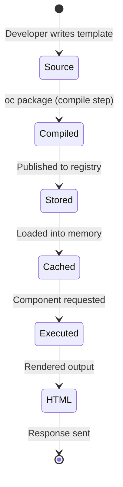
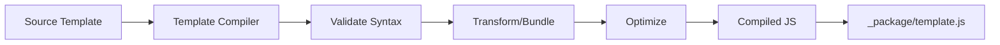

## What are Templates?

Templates define how components render their HTML output. OpenComponents supports multiple template engines, each compiled and executed differently:

<CardGroup cols={3}>
  <Card title="Handlebars" icon="h" color="#f0652f">
    Logic-less, mustache-based templates
  </Card>
  <Card title="Jade/Pug" icon="gem" color="#a86454">
    Indentation-based, concise syntax
  </Card>
  <Card title="React/ES6" icon="react" color="#61dafb">
    Modern React components with JSX
  </Card>
</CardGroup>

## Template Interface

All template engines implement a standard interface:

```typescript
interface Template {
  // Optional: Compile template during packaging
  compile?: (options: CompilerOptions, callback: Callback) => void;
  
  // Get compiled template function
  getCompiledTemplate: (
    templateString: string,
    key: string,
    context?: Record<string, unknown>
  ) => CompiledTemplate;
  
  // Get template metadata
  getInfo: () => TemplateInfo;
  
  // Render template with data
  render: (options: RenderOptions, callback: Callback) => void;
}

type CompiledTemplate = (model: unknown) => string;
```

**Location:** `src/types.ts:423-432`

## Template Registration

Templates are registered when the registry starts:

```typescript
// src/registry/domain/register-templates.ts
import * as es6Template from 'oc-template-es6';
import handlebarsTemplate from 'oc-template-handlebars';
import jadeTemplate from 'oc-template-jade';

const registry = Registry({
  templates: [
    // Core templates are always included
    es6Template,
    handlebarsTemplate,
    jadeTemplate,
    
    // Add custom templates
    myCustomTemplate
  ]
});
```

### Template Info Structure

```typescript
interface TemplateInfo {
  type: string;              // Template type identifier
  version: string;           // Template engine version
  externals: Array<{         // External dependencies
    name: string;            // Package name
    global: string | string[];  // Global variable name
    url: string;             // CDN URL
    devUrl?: string;         // Development URL
  }>;
}
```

**Example:**

```typescript
{
  type: 'oc-template-react',
  version: '2.0.0',
  externals: [
    {
      name: 'react',
      global: 'React',
      url: 'https://cdn.jsdelivr.net/npm/react@18/umd/react.production.min.js',
      devUrl: 'https://cdn.jsdelivr.net/npm/react@18/umd/react.development.js'
    }
  ]
}
```

## Template Lifecycle



## Core Templates

### Handlebars Template

<Tabs>
  <Tab title="Overview">
    - **Package**: `oc-template-handlebars`
    - **Type**: `handlebars`
    - **Extension**: `.hbs`
    - **Runtime**: Logic-less, mustache syntax
    
    **Best for:**
    - Simple, presentational components
    - Teams preferring separation of logic and view
    - Components without complex rendering logic
  </Tab>
  
  <Tab title="Example">
    ```handlebars
    {{! template.hbs }}
    <div class="user-profile">
      <h1>{{user.name}}</h1>
      <p class="email">{{user.email}}</p>
      
      {{#if user.avatar}}
        
      {{else}}
        <div class="placeholder">No avatar</div>
      {{/if}}
      
      <ul class="interests">
        {{#each user.interests}}
          <li>{{this}}</li>
        {{/each}}
      </ul>
      
      {{#if user.isVerified}}
        <span class="badge">✓ Verified</span>
      {{/if}}
    </div>
    ```
  </Tab>
  
  <Tab title="Helpers">
    Handlebars includes built-in helpers:
    
    ```handlebars
    {{! Conditionals }}
    {{#if condition}}...{{/if}}
    {{#unless condition}}...{{/unless}}
    
    {{! Loops }}
    {{#each items}}{{this}}{{/each}}
    
    {{! With context }}
    {{#with user}}
      {{name}} - {{email}}
    {{/with}}
    
    {{! Comparisons }}
    {{#if (eq value "test")}}...{{/if}}
    {{#if (gt count 10)}}...{{/if}}
    
    {{! Unescaped HTML }}
    {{{rawHtmlContent}}}
    ```
  </Tab>
</Tabs>

### Jade Template

<Tabs>
  <Tab title="Overview">
    - **Package**: `oc-template-jade`
    - **Type**: `jade`
    - **Extension**: `.jade`
    - **Runtime**: Indentation-based
    
    **Best for:**
    - Concise template syntax
    - Developers familiar with Pug/Jade
    - Reducing template verbosity
  </Tab>
  
  <Tab title="Example">
    ```jade
    //- template.jade
    .user-profile
      h1= user.name
      p.email= user.email
      
      if user.avatar
        img(src=user.avatar alt="Avatar")
      else
        .placeholder No avatar
      
      ul.interests
        each interest in user.interests
          li= interest
      
      if user.isVerified
        span.badge ✓ Verified
    ```
  </Tab>
  
  <Tab title="Features">
    ```jade
    //- Variables
    p= description
    p!= htmlContent
    
    //- Attributes
    a(href=url class="link" data-id=id)
    
    //- Conditionals
    if isActive
      span Active
    else
      span Inactive
    
    //- Loops
    each item, index in items
      li(data-index=index)= item
    
    //- Mixins (reusable blocks)
    mixin button(text)
      button.btn= text
    
    +button('Click me')
    ```
  </Tab>
</Tabs>

### React/ES6 Template

<Tabs>
  <Tab title="Overview">
    - **Package**: `oc-template-es6` or `oc-template-react`
    - **Type**: `oc-template-es6` / `oc-template-react`
    - **Extension**: `.jsx`
    - **Runtime**: React components with hooks
    
    **Best for:**
    - Complex interactive components
    - Modern React development
    - Client-side hydration and interactivity
    - Shared components between SSR and CSR
  </Tab>
  
  <Tab title="Example">
    ```jsx
    // template.jsx
    import { useState, useEffect } from 'react';
    
    export default function UserProfile({ user, staticPath }) {
      const [expanded, setExpanded] = useState(false);
      
      useEffect(() => {
        console.log('Component mounted');
      }, []);
      
      return (
        <div className="user-profile">
          <h1>{user.name}</h1>
          <p className="email">{user.email}</p>
          
          {user.avatar ? (
            
          ) : (
            <div className="placeholder">No avatar</div>
          )}
          
          <button onClick={() => setExpanded(!expanded)}>
            {expanded ? 'Hide' : 'Show'} Interests
          </button>
          
          {expanded && (
            <ul className="interests">
              {user.interests.map((interest, idx) => (
                <li key={idx}>{interest}</li>
              ))}
            </ul>
          )}
          
          {user.isVerified && (
            <span className="badge">✓ Verified</span>
          )}
          
          <link rel="stylesheet" href={staticPath + 'style.css'} />
        </div>
      );
    }
    ```
  </Tab>
  
  <Tab title="Props">
    React templates receive props:
    
    ```typescript
    interface TemplateProps {
      // Data from data provider
      [key: string]: any;
      
      // Injected by OpenComponents
      staticPath: string;      // Path to static assets
      _staticPath: string;     // Alias for staticPath
      baseUrl: string;         // Registry base URL
      renderInfo?: RenderInfo; // Render metadata (if enabled)
    }
    ```
    
    **Render info:**
    ```typescript
    interface RenderInfo {
      name: string;
      version: string;
      renderMode: 'rendered' | 'unrendered' | 'pre-rendered';
    }
    ```
  </Tab>
</Tabs>

## Template Compilation

Templates are compiled during the `oc package` step:

### Compilation Process



### Compiler Options

```typescript
interface CompilerOptions {
  componentPackage: PackageJson & { oc: OcConfiguration };
  componentPath: string;     // Source directory
  minify: boolean;           // Minify output
  ocPackage: PackageJson;    // OC version info
  production: boolean;       // Production mode
  publishPath: string;       // Output directory
  verbose: boolean;          // Logging
  watch: boolean;            // Watch mode
}
```

### Compilation Example

<CodeGroup>
```handlebars Source (template.hbs)
<div class="hello">
  <h1>{{title}}</h1>
  <p>{{message}}</p>
</div>
```

```javascript Compiled (_package/template.js)
module.exports = function(Handlebars) {
  return Handlebars.template({
    "compiler": [8, ">= 4.3.0"],
    "main": function(container, depth0, helpers, partials, data) {
      var helper, lookupProperty = /* ... */;
      return '<div class="hello">\n  <h1>'
        + container.escapeExpression(((helper = (helper = lookupProperty(helpers, "title") 
        || (depth0 != null ? lookupProperty(depth0, "title") : depth0)) != null ? helper : container.hooks.helperMissing),
        (typeof helper === "function" ? helper.call(depth0 != null ? depth0 : (container.nullContext || {}), 
        {"name":"title","hash":{},"data":data,"loc":{"start":{"line":2,"column":6},"end":{"line":2,"column":15}}}) : helper)))
        + '</h1>\n  <p>'
        + container.escapeExpression(((helper = (helper = lookupProperty(helpers, "message"))
        // ... more generated code
        + '</p>\n</div>';
    }
  });
};
```
</CodeGroup>

## Template Rendering

When a component is requested, the registry renders it:

### Server-Side Rendering

```typescript
// Pseudocode from registry internals
async function renderComponent(component: Component, data: any) {
  // 1. Get compiled template
  const templateString = await repository.getCompiledView(
    component.name,
    component.version
  );
  
  // 2. Get template engine
  const template = repository.getTemplate(component.oc.files.template.type);
  
  // 3. Get compiled template function
  const compiledTemplate = template.getCompiledTemplate(
    templateString,
    component.oc.files.template.hashKey
  );
  
  // 4. Inject static path and other props
  const model = {
    ...data,
    staticPath: repository.getStaticFilePath(
      component.name,
      component.version,
      ''
    ),
    baseUrl: config.baseUrl
  };
  
  // 5. Render to HTML
  const html = compiledTemplate(model);
  
  return html;
}
```

### Client-Side Rendering (React)

React templates support client-side hydration:

```javascript
// Client-side code (automatically generated)
import React from 'react';
import ReactDOM from 'react-dom';
import Component from './template';

// Server sends component data
const data = window.__OC_DATA__;

// Hydrate on client
ReactDOM.hydrate(
  <Component {...data} />,
  document.getElementById('oc-component-root')
);
```

## Custom Templates

You can create custom template engines:

### Implementation

```typescript
import type { Template, TemplateInfo } from 'opencomponents';

const myTemplate: Template = {
  // Compile step (runs during oc package)
  compile: (options, callback) => {
    const { componentPath, publishPath, minify } = options;
    
    try {
      // Read source template
      const source = fs.readFileSync(
        path.join(componentPath, 'template.mytpl'),
        'utf8'
      );
      
      // Compile/transform
      const compiled = myCompiler.compile(source, { minify });
      
      // Write to _package
      fs.writeFileSync(
        path.join(publishPath, 'template.js'),
        compiled
      );
      
      callback(null);
    } catch (error) {
      callback(error);
    }
  },
  
  // Get compiled template function
  getCompiledTemplate: (templateString, key) => {
    // Load compiled template
    const templateFn = eval(templateString);
    
    // Return function that accepts data and returns HTML
    return (model) => templateFn(model);
  },
  
  // Template metadata
  getInfo: (): TemplateInfo => ({
    type: 'my-template',
    version: '1.0.0',
    externals: [
      {
        name: 'my-runtime',
        global: 'MyRuntime',
        url: 'https://cdn.example.com/my-runtime.min.js'
      }
    ]
  }),
  
  // Server-side render (alternative to getCompiledTemplate)
  render: (options, callback) => {
    const { model, key, template } = options;
    
    try {
      const html = myRenderer.render(template, model);
      callback(null, html);
    } catch (error) {
      callback(error, '');
    }
  }
};

export default myTemplate;
```

### Registration

```typescript
import myTemplate from './my-template';

const registry = Registry({
  templates: [myTemplate]
});
```

## Template Best Practices

<AccordionGroup>
  <Accordion title="Performance" icon="gauge-high">
    - **Pre-compile templates**: Always compile during packaging, not at runtime
    - **Minimize template size**: Smaller compiled templates load faster
    - **Cache compiled functions**: The registry caches compiled templates in memory
    - **Avoid heavy logic**: Move complex logic to data provider
  </Accordion>
  
  <Accordion title="Security" icon="shield">
    - **Escape user input**: Always escape untrusted data (Handlebars does this by default)
    - **Sanitize HTML**: If rendering user-provided HTML, sanitize it first
    - **Content Security Policy**: Consider CSP headers for inline scripts
    - **XSS prevention**: Never use `dangerouslySetInnerHTML` with untrusted content
  </Accordion>
  
  <Accordion title="Maintainability" icon="screwdriver-wrench">
    - **Keep templates simple**: Complex logic belongs in data provider
    - **Use consistent patterns**: Stick to one template type per project
    - **Document props**: Add PropTypes or TypeScript types for React templates
    - **Test rendering**: Write tests for different data scenarios
  </Accordion>
  
  <Accordion title="Accessibility" icon="universal-access">
    - **Semantic HTML**: Use proper HTML5 elements
    - **ARIA labels**: Add aria-label for icon buttons and links
    - **Keyboard navigation**: Ensure interactive elements are keyboard accessible
    - **Screen reader testing**: Test with screen readers
  </Accordion>
</AccordionGroup>

## Template Debugging

### Development Mode

```bash
# Start dev server with source maps
oc dev . 3030
```

In development mode:
- Templates are not minified
- Source maps are generated
- Hot reloading is enabled
- Development URLs used for externals

### Error Handling

Template errors are caught and reported:

```javascript
// Error response
{
  "error": "Template compilation error",
  "details": "Unexpected token at line 42",
  "code": "TEMPLATE_ERROR"
}
```

## Next Steps

<CardGroup cols={2}>
  <Card title="Component Concepts" href="/concepts/components" icon="cube">
    Learn about component structure
  </Card>
  <Card title="Plugin System" href="/concepts/plugins" icon="puzzle-piece">
    Extend template functionality with plugins
  </Card>
  <Card title="Creating Components" href="/components/creating-components" icon="plus">
    Build your first component
  </Card>
  <Card title="Custom Templates" href="/advanced/custom-templates" icon="box">
    Create custom template engines
  </Card>
</CardGroup>